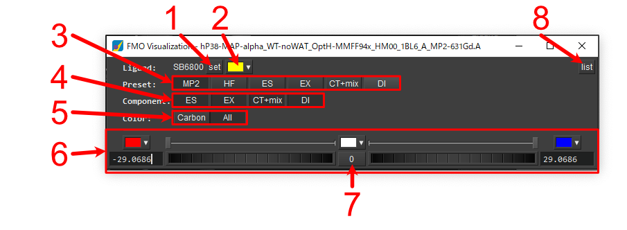
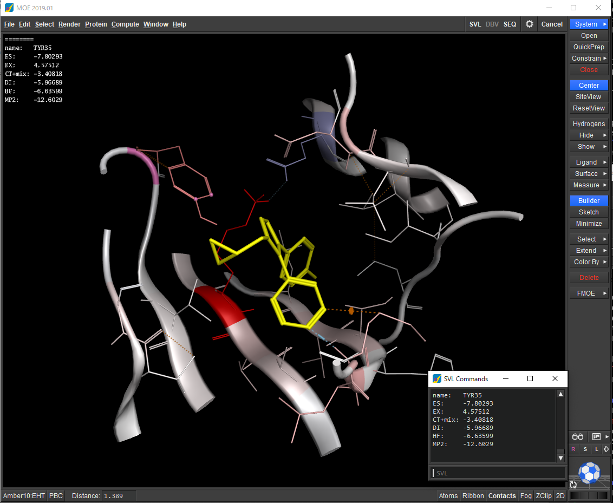
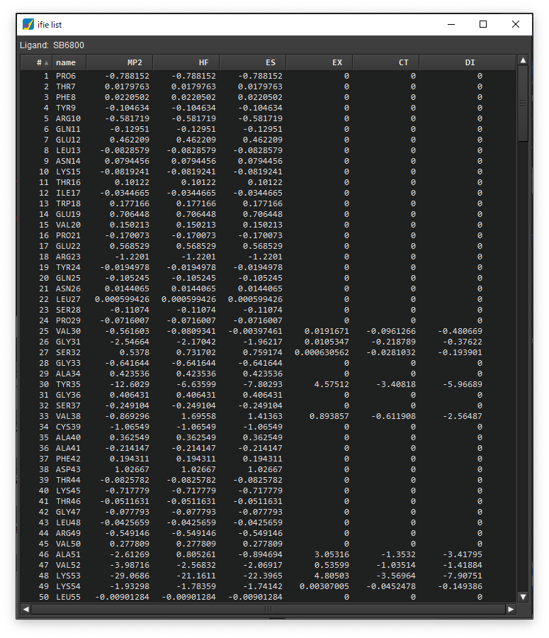

# FMOE-0.4.0 使用方法

## インストール

1. [Github Releases](https://github.com/philopon/FMOE/releases/latest) (https://github.com/philopon/FMOE/releases/latest) から、
   最新版のファイル一式をダウンロードする。

1. `ユーザーディレクトリ/moefiles` 以下に解凍

    Windows 10 では `C:\ユーザー\(ユーザー名)\moefiles\FMOE`

1. `ユーザーディレクトリ/moefiles/start.svl` に設定を追加

    例)

    ```
    local function main []
        run '$HOME/moefiles/FMOE/loader.svl';
    endfunction
    ```

1. MOE を起動して、右のメニューに FMOE が追加されていたらインストール完了

    

## フラグメンテーション

1. 分子の前処理を行った後、 `FMOE → Fragmentation` を選択する。

2. ポップアップする window から切断位置を選択する。

    

    1. たんぱく質に対して再度自動フラグメント分割を行う。
    2. 手動でフラグメントを分割する。ボタンをクリックした後、BDA、BAA の順で原子を選択する。
    3. 4 のリストで選択している分割される結合を削除する。
    4. 全ての切断リストを削除する。
    5. 分割される結合のリスト。ダブルクリックするとズームする。

        - #: 通し番号
        - T: 切断が自動フラグメント分割によるもの (A) か、手動分割によるもの (M) か
        - Res.: フラグメントの残基名、残基番号
        - BDA: BDA の原子番号、原子名
        - BAA: BAA の原子番号、原子名

    6. 基底関数の選択ダイアログ
    7. 8に表示されるAOを選択した基底関数で更新する。
    8. フラグメントのリスト。クリックすると原子が選択される。

        - #: 通し番号
        - Res.: 残基名
        - nA: 原子数
        - AO: 原子軌道の数
        - D: BDAの数
        - A: BAAの数
        - C: フラグメントの形式電荷

    9. テンプレート (後述) の選択
    10. 出力ボタン

3. 6 でテンプレートを選択し、7 の出力ボタンをクリックし、保存場所を選択すると、PDB ファイルと ajf ファイルが出力される

### テンプレート

FMOE は選択したテンプレートを雛形に、 `{{変数名}}`の部分を置換する。変数は以下のいずれか

- `BASENAME`: 保存ダイアログで指定したファイル名
- `TOTAL_CHARGE`: 総形式電荷
- `NUM_FRAGS`: フラグメント数
- `BASIS_SET`: 選択した基底関数
- `ABINITMP_FRAGMENT`: ABINIT-MPの`&FRAGMENT`セクション

このテンプレートを `$HOME/moefiles/ajf` 以下に設置すると、自動で読み込まれ、リストに表示される。

## 可視化

1. `FMOE → Visualization` を選択し、cpf ファイルを選択する。
2. ポップアップする window から表示を調節する。

    

    1. 現在選択されている原子を含むフラグメントをリガンドとして設定する。
    2. リガンドの色選択
    3. 表示するエネルギーの種類を選択
    4. 表示する PIEDA の成分を選択
    5. IFIE に従って色を付ける原子を選択

        Carbon: 炭素原子のみ。ヘテロ原子はその原子の色 (窒素=青 など)
        All: 全原子。

    6. エネルギーの表示範囲、色の選択
    7. 表示範囲のリセット
    8. リガンドとの IFIE の一覧ウインドウを表示

3. 画面上で原子を選択すると、画面右上及び SVL ウインドウにリガンドとの相互作用が表示される。

    

    - 選択された原子が全て 1 つのフラグメントに含まれる場合: そのフラグメントとリガンドの ifie
    - 複数のフラグメントに含まれる場合:
      フラグメントの原子の過半数が選択されたフラグメントとリガントとの ifie の和

4. カラースケールは sequence editor にも反映される。

    

5. 8のlistボタンを押すとIFIE/PIEDAの一覧ウインドウが表示される

    
